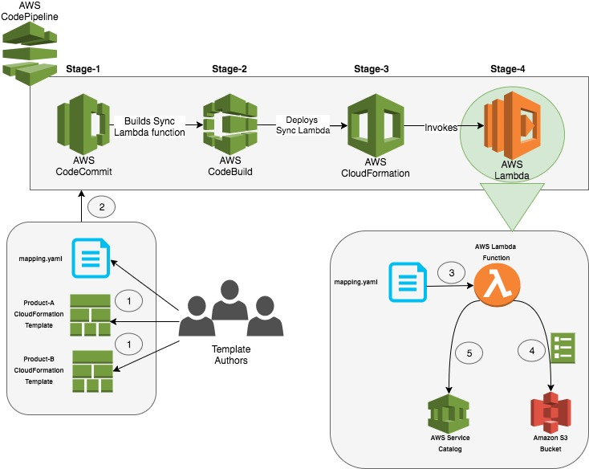

# Pipeline To Service Catalog

This architecture and sample demoonstrates how to simplify management of the
[AWS Service Catalogs]([service-catalog-url]),related products and sharing of portfolios with other
accounts truly by maintaining them in version control, thereby adopting “Infrastructure as Code”
practices. This solution also delivers the updates to the products using a Continuous Delivery
[AWS CodePipeline](code-pipeline-url)

For more details, refer the blogpost

[][architecture]

## Specifics on the mapping.yaml file

mapping.yaml is the core configuration component of this solution, which defines how your portfolio , permissions and products associated with the portfolio are defined.
This configuration file is how your portfolio will look like in Service Catalog, when deployed by this solution.

### __Description of properties__

* __name (string)__  

    Display name of the portfolio. This is the unique identifier and must match any already existing portfolio.  
    __Length Constraints:__ Minimum length of 1. Maximum length of 100.  
    __Example:__ Infrastructure  

* __description (string)__  

    Description of the portfolio. This field in the mapping.json overrides the description of the portfolio in service catalog during the sync operation, so that the mapping.json is the ultimate source of truth.  
    __Length Constraints:__ Maximum length of 2000.  
    __Example:__ Includes all the products related to infrastructure  

* __owner (string)__  
    Owner of the portfolio. This field in the mapping.json overrides the owner of the portfolio in service catalog during the sync operation, so that the mapping.json is the ultimate source of truth.  
    __Length Constraints:__ Minimum length of 1. Maximum length of 20.  
    __Example:__ operations

* __products (list)__  
    * __name (string)__  
    Display name of the product. This is the unique identifier and must match any already existing product. A new product will be created and associated with the portfolio, if the name does not matches with any product already associated in the portfolio. If a match is found, a new version of the product will be created.  
    __Example:__ VPC

    * __template (string)__  
    Name of the CloudFormation template on file system  
    __Example:__ product-vpc.yaml  
    * __owner(string)__  
    Owner of the template, who has authored this template  
    __Example:__ team1@example.com  
    * __description(string)__  
    Description of the product  
    __Example:__ VPC and 4 subnet architecture  

* __accounts (list)__  
    List of accounts, with which you wish to share the portfolio with.  
    If you add new accounts in the list, the portfolio will be shared with that account. If you remove any account from the list, the portfolio will be un-shared with that account.  
    Must be a valid AWS Account.  
    * __identifier (string)__  
    Friendly name with which you wish to identify the account number  
    __Example:__ Test Account  
    * __number (string)__  
    AWS Account number, with which you wish to share the portfolio with  
    __Example:__ 123456789012

* __tags (list)__  
    Key value pair to tag the portfolio with  
    * __Key(string)__  
    The Key name  
    * __Value (string)__  
    The value of the Key  

* __principals (list)__  
    List of IAM Users, Roles or Groups to allow using the products in the portfolio in the current account.
    Must start with __arn:aws:iam::__
    Must be either IAM Role (__role/SOME_ROLE__) or IAM User (__user/SOME_USR__)
    or IAM Group (__group/SOME_GROUP__)
    __Example:__
        - arn:aws:iam::123456789012:role/Admin
        - arn:aws:iam::123456789012:user/name
        - arn:aws:iam::123456789012:group/AdminGroup

[code-commit-url]: https://aws.amazon.com/devops/continuous-delivery/
[code-build-url]: https://aws.amazon.com/codebuild/
[code-pipeline-url]: https://aws.amazon.com/codepipeline/
[clouformation-url]: https://aws.amazon.com/cloudformation/
[lambda-url]: https://aws.amazon.com/lambda/
[service-catalog-url]: https://aws.amazon.com/servicecatalog/